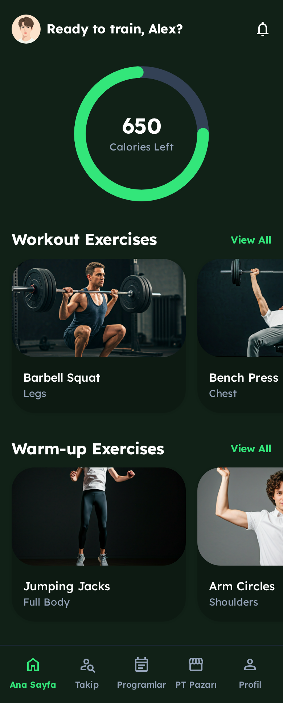
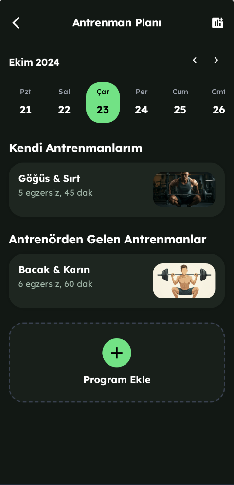
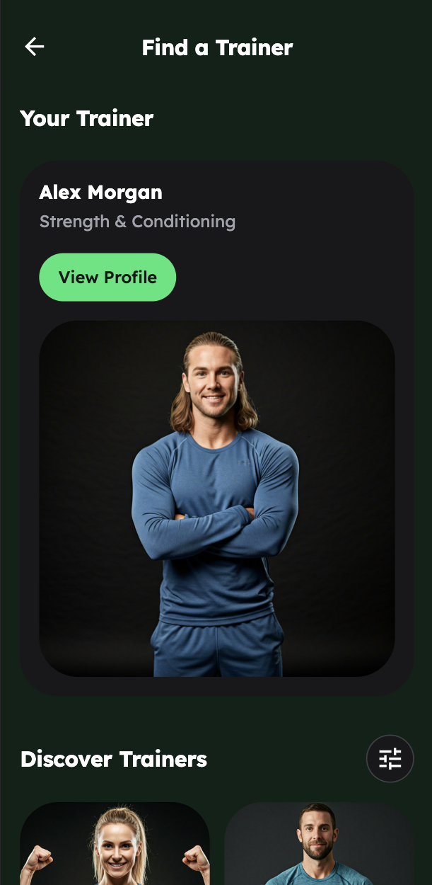
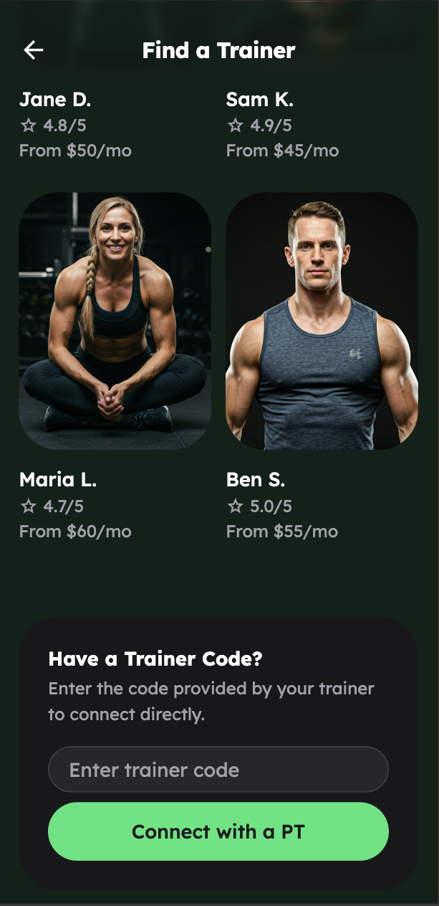

# Fitness PT Marketplace & Tracking App

Fitness alanında kişisel antrenörler (PT) ile sporcuları bir araya getiren; PT’lerin öğrenci bulabildiği, antrenman ve diyet programlarını yönetebildiği, sporcuların ise paket satın alıp ilerlemelerini takip edebildiği mobil uygulama.

## Proje Özeti

Bu uygulama, fitness sektöründe **online koçluk ve takip süreçlerini dijitalleştirmeyi** amaçlayan bir **marketplace** ve **yönetim platformudur**. 

### Ana Özellikler
- **PT'ler için:**
  - Profil oluşturma (Profil bilgileri + Eğitim Paketleri)
  - Marketplace de listelenme ve öğrenci bulma
  - Antrenman ve diyet programlarını oluşturma, öğrencilere atama
  - İlerleme takip tablosu ile öğrencilerin gelişimini izleme
- **Sporcular için:**
  - PT paketlerini inceleme ve satın alma
  - Antrenman ve diyet programlarını takip etme
  - PT ile uygulama içi etkileşimli tablolar 

## Screenshots

### Athlete Home Screen

### Athlete Workout Tracking

### Marketplace (Athlete View)

